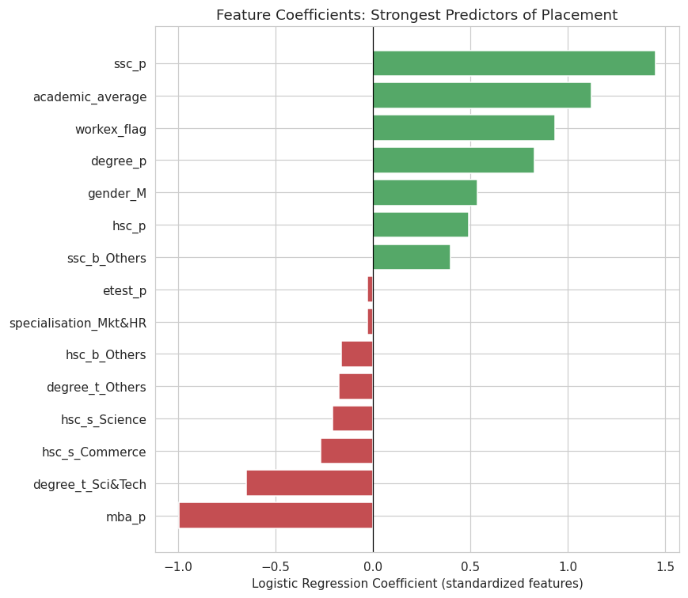
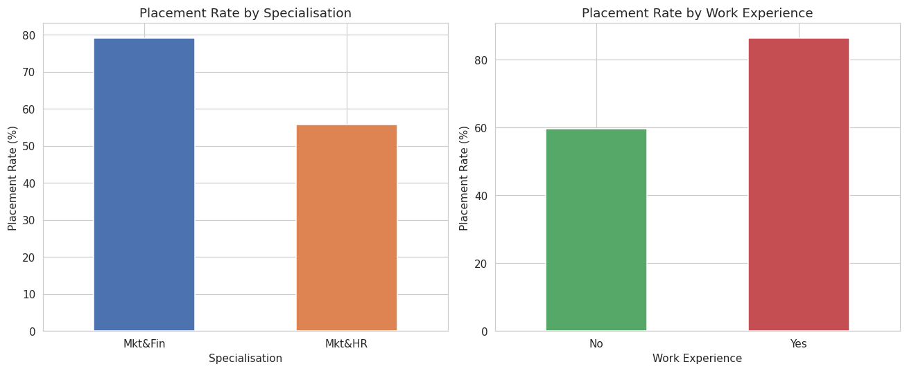
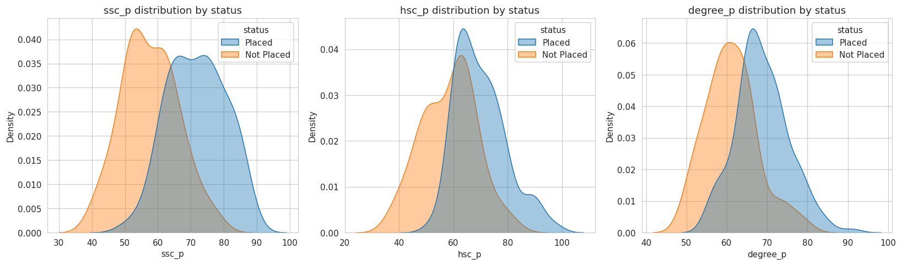
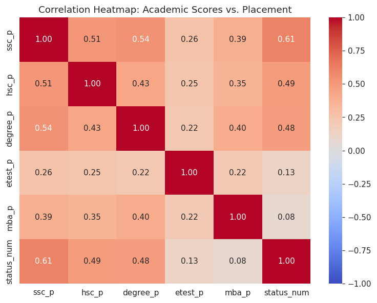
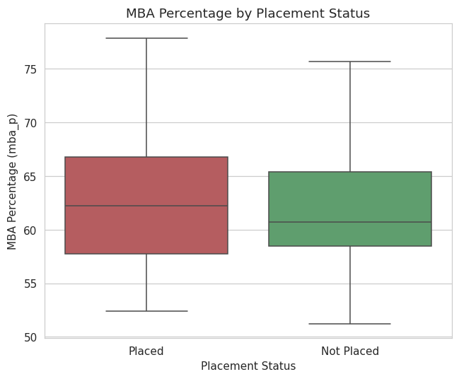
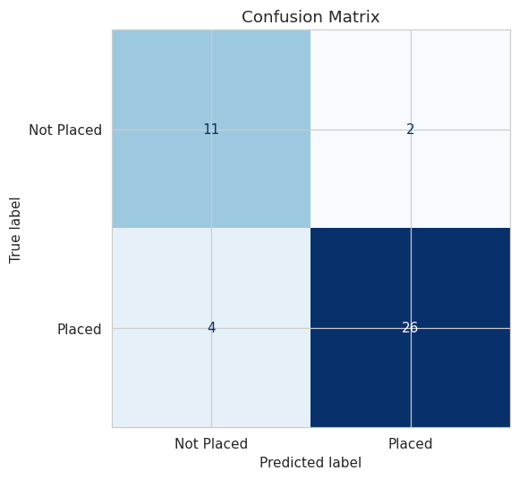

# Student Placement Prediction

**Difficulty Level:** Beginner to Intermediate
**Model:** Logistic Regression
**Dataset:** [Campus Recruitment Dataset (Kaggle — benroshan)](https://www.kaggle.com/datasets/benroshan/factors-affecting-campus-placement)
**Libraries:** pandas, numpy, matplotlib, seaborn, scikit-learn


---

## 1. Problem Statement

A university's placement cell wants to predict which students are likely to be placed in campus recruitment based on academic and employability factors.

## 2. Business Objective

Build a classification model that predicts placement status so the placement cell can proactively support students who are less likely to be placed.

## 3. Dataset

- **Source:** Kaggle — Campus Recruitment Dataset (benroshan)
- **Rows / Columns:** 215 students × 15 columns (14 features + `status` target, before dropping `salary`/`sl_no`)
- **Key columns used:** `ssc_p`, `hsc_p`, `degree_p`, `workex`, `etest_p`, `specialisation`, `mba_p`, `gender`, `hsc_s`, `degree_t`, `ssc_b`, `hsc_b`, `status`
- **Target:** `status` (`Placed` / `Not Placed`)
- **Important note:** `salary` is only populated for placed students (67 missing values, exactly matching the 67 "Not Placed" students). It is **dropped entirely** from the feature set because it leaks the target.

## 4. Approach / Workflow

```
Data Collection → Data Cleaning → EDA → Feature Engineering → Model Building → Evaluation → Recommendations
```

### Data Cleaning
- Dropped `salary` (target leakage) and `sl_no` (identifier, no predictive value).
- Verified all percentage columns (`ssc_p`, `hsc_p`, `degree_p`, `etest_p`, `mba_p`) fall within 0–100.
- Standardized categorical text (stripped whitespace) across `gender`, `workex`, `specialisation`, and other categorical columns.

### EDA
- Placement rate by specialisation and work experience (bar charts).
- Distribution of `ssc_p`, `hsc_p`, `degree_p` split by placement status (KDE plots).
- Correlation heatmap of numeric academic scores vs. placement.
- Boxplot of `mba_p` by placement status.

### Feature Engineering
- Created a binary `workex_flag` (0/1) from `workex`.
- Created an `academic_average` feature from the mean of `ssc_p`, `hsc_p`, `degree_p`.
- One-hot encoded `gender`, `hsc_s`, `degree_t`, `specialisation`, `ssc_b`, `hsc_b` (drop-first encoding to avoid the dummy-variable trap).

### Model Building
- Features standardized with `StandardScaler`.
- 80/20 train/test split, **stratified** on `status` to preserve class balance.
- `LogisticRegression` (scikit-learn, `max_iter=1000`) trained on the scaled features.

## 5. Results

| Metric | Score |
|---|---|
| Accuracy | **0.860** |
| Precision (Placed) | **0.929** |
| Recall (Placed) | **0.867** |
| F1 score (Placed) | **0.897** |

**Confusion matrix and full classification report** are in the notebook (`Notebook/student_placement_prediction.ipynb`), Section 8.

### Strongest predictors of placement (ranked coefficients)
Positive (increase placement likelihood): `ssc_p`, `academic_average`, `workex_flag`, `degree_p`, `gender_M`, `hsc_p`
Negative (decrease placement likelihood): `degree_t_Sci&Tech`, `mba_p` (weak/negative once other scores are controlled for)



## 6. Additional Requirement — Placement-Improvement Recommendations

1. **Work experience is one of the strongest positive levers.** Placement rate: **86.5%** with work experience vs. **59.6%** without. Students should prioritize securing at least one internship before placement season.
2. **Specialisation matters a lot.** Placement rate: **79.2%** for Mkt&Fin vs. **55.8%** for Mkt&HR. Students in the lower-performing track should build supplementary skills/certifications and target relevant projects.
3. **Early, cumulative academic performance is the strongest predictor block** — `ssc_p`, `hsc_p`, `degree_p`, and `academic_average` all rank highly. Interestingly, the final MBA percentage (`mba_p`) shows only a weak raw correlation (0.08) with placement and a negative coefficient in the full model — suggesting outcomes lean more on a student's overall academic track record than the final MBA score alone. This is a **correlation, not a proven causal effect**, given the dataset's small size (215 rows, one institution).
4. The placement cell should proactively flag students with **no work experience + below-average `academic_average`** early, and offer them targeted internship support.

## 7. Visualizations

| Chart | Description |
|---|---|
|  | Placement rate by specialisation and work experience |
|  | `ssc_p`/`hsc_p`/`degree_p` distribution by placement status |
|  | Correlation of academic scores with placement |
|  | `mba_p` by placement status |
|  | Test-set confusion matrix |
|  | Ranked logistic regression coefficients |

## 8. Common Mistakes Avoided

- ✅ `salary` excluded from the feature set (would otherwise leak the target and produce unrealistically perfect accuracy).
- ✅ Train/test split stratified on `status` since the classes are imbalanced (148 Placed vs. 67 Not Placed).
- ✅ Recommendations explicitly note that academic-score correlations are not proof of causation.

## 9. How to Run

1. Clone this repo.
2. Ensure `pandas`, `numpy`, `matplotlib`, `seaborn`, and `scikit-learn` are installed (`pip install pandas numpy matplotlib seaborn scikit-learn`).
3. Open `Notebook/student_placement_prediction.ipynb` in Jupyter and run all cells (dataset path is relative: `../Dataset/Placement_Data_Full_Class.csv`).


## 11. Submission Checklist

- [x] Dataset downloaded and loaded successfully into the notebook
- [x] All Data Cleaning Tasks completed
- [x] At least 4 EDA visualizations created and explained
- [x] Feature engineering steps applied as described
- [x] Logistic Regression model trained successfully
- [x] Evaluation metrics calculated, printed, and interpreted
- [x] Additional requirement completed: placement-improvement recommendations
- [x] Notebook has all cells run with outputs visible
- [ ] Notebook uploaded to GitHub (do this after downloading the project folder)
- [x] README.md completed
